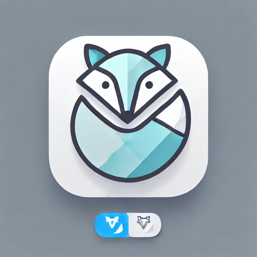

# Scene Dialogue Language Learning 

An interactive language learning application that uses AI-generated scene-based dialogues to help users practice real-world conversations.

## Overview

This project combines practical scenario-based learning with AI technology to create an immersive language learning experience. Users can practice conversations in various daily life situations, making language learning more engaging and practical.

## Features

- Scene-based dialogue practice
- AI-powered conversation generation
- Multiple language support
- Interactive learning experience

## Tech Stack

## License

[MIT License](LICENSE)
